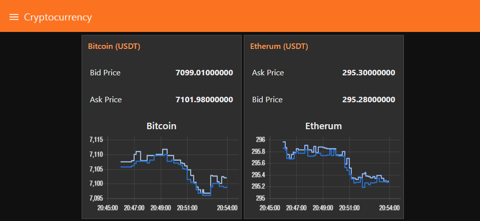

# Creating a Dashboard displaying Cryptocurrency Data using Node-RED

<!-- TOC -->

- [Creating a Dashboard displaying Cryptocurrency Data using Node-RED](#creating-a-dashboard-displaying-cryptocurrency-data-using-node-red)
  - [Flow Export](#flow-export)
  - [Flow Export](#flow-export-1)
  - [Working with the Node-RED Dashboard](#working-with-the-node-red-dashboard)
    - [Adding Text Outputs](#adding-text-outputs)
      - [Flow Export](#flow-export-2)
    - [Adding a Graph](#adding-a-graph)
      - [Flow Export](#flow-export-3)

<!-- /TOC -->



We will use the STS [Binance](https://www.binance.com/) node to get access to a Cryptocurrency API. The node can be downloaded for [Node-RED](https://www.npmjs.com/package/node-red-contrib-binance). The following flow will get us the exchange price for Etherium:


## Flow Export

```json
[{"id":"3e6606c0.272afa","type":"inject","z":"d20a8b82.28b458","name":"","topic":"ETHUSDT","payload":"","payloadType":"str","repeat":"","crontab":"","once":false,"onceDelay":0.1,"x":101,"y":122,"wires":[["c51a6ca4.fed82"]]},{"id":"c51a6ca4.fed82","type":"binance-get-price","z":"d20a8b82.28b458","name":"","ticker":"","x":253,"y":122,"wires":[["7d28d821.7a2098"]]},{"id":"7d28d821.7a2098","type":"debug","z":"d20a8b82.28b458","name":"","active":true,"tosidebar":true,"console":false,"tostatus":false,"complete":"false","x":414,"y":122,"wires":[]}]
```

We start with setting an __Inject Node__ to an _empty string_ and its topic to __ETHUSDT__ ([exchange chart](https://www.binance.com/en/trade/ETH_USDT)) and connecting it to __getPrice Node__ - a __Debug Node__ will give us the result in form of a string - e.g. `294.50000000`.


Let’s continue the example shown above but extend it to get all market info. For that we’ll need the __getAllPrices Node__:

##  Flow Export

```json
[{"id":"c458d9ea.5aa5c8","type":"inject","z":"d20a8b82.28b458","name":"","topic":"","payload":"","payloadType":"str","repeat":"","crontab":"","once":false,"onceDelay":0.1,"x":88,"y":202,"wires":[["777eaa32.d87b94"]]},{"id":"8d15769d.939e18","type":"debug","z":"d20a8b82.28b458","name":"","active":true,"tosidebar":true,"console":false,"tostatus":false,"complete":"false","x":411,"y":202,"wires":[]},{"id":"777eaa32.d87b94","type":"binance-get-all-prices","z":"d20a8b82.28b458","name":"","x":241,"y":203,"wires":[["8d15769d.939e18"]]}]
```

You’ll get back a JSON object:

```json
{"ETHBTC":"0.04154500","LTCBTC":"0.00881100","BNBBTC":"0.00158410","NEOBTC":"0.00293500","QTUMETH":"0.01625400","EOSETH":"0.02107000","SNTETH":"0.00014760","BNTETH":"0.00586300","BCCBTC":"0.07934100","GASBTC":"0.00099600","BNBETH":"0.03815800","BTCUSDT":"7087.54000000","ETHUSDT":"294.56000000","OAXETH":"0.00060790","DNTETH":"0.00008768","MCOETH":"0.01587500","ICNETH":"0.00162160","MCOBTC":"0.00065600","WTCBTC":"0.00058470","WTCETH":"0.01403500","LRCBTC":"0.00001880","LRCETH":"0.00045696","QTUMBTC":"0.00067500","YOYOBTC":"0.00000389","OMGBTC":"0.00062600","OMGETH":"0.01506100","ZRXBTC":"0.00011409","ZRXETH":"0.00274185","STRATBTC":"0.00023200","STRATETH":"0.00556200","SNGLSBTC":"0.00000358","SNGLSETH":"0.00008614","BQXBTC":"0.00007643","BQXETH":"0.00184060","KNCBTC":"0.00008018","KNCETH":"0.00193560","FUNBTC":"0.00000264","FUNETH":"0.00006301","SNMBTC":"0.00000867","SNMETH":"0.00020999","NEOETH":"0.07071400","IOTABTC":"0.00011167","IOTAETH":"0.00269772","LINKBTC":"0.00004652","LINKETH":"0.00112169","XVGBTC":"0.00000216","XVGETH":"0.00005220","SALTBTC":"0.00009110","SALTETH":"0.00219200","MDABTC":"0.00010141","MDAETH":"0.00242000","MTLBTC":"0.00009700","MTLETH":"0.00233400","SUBBTC":"0.00002510","SUBETH":"0.00060521","EOSBTC":"0.00087520","SNTBTC":"0.00000615","ETCETH":"0.04462400","ETCBTC":"0.00185300","MTHBTC":"0.00000350","MTHETH":"0.00008508","ENGBTC":"0.00011371","ENGETH":"0.00275400","DNTBTC":"0.00000365","ZECBTC":"0.02178200","ZECETH":"0.52429000","BNTBTC":"0.00024263","ASTBTC":"0.00001546","ASTETH":"0.00037070","DASHBTC":"0.02800500","DASHETH":"0.67228000","OAXBTC":"0.00002511","ICNBTC":"0.00006779","BTGBTC":"0.00314000","BTGETH":"0.07550700","EVXBTC":"0.00006646","EVXETH":"0.00160670","REQBTC":"0.00000681","REQETH":"0.00016531","VIBBTC":"0.00000601","VIBETH":"0.00014417","TRXBTC":"0.00000378","TRXETH":"0.00009076","POWRBTC":"0.00002953","POWRETH":"0.00071345","ARKBTC":"0.00012980","ARKETH":"0.00311500","YOYOETH":"0.00009421","XRPBTC":"0.00004887","XRPETH":"0.00117541","MODBTC":"0.00014340","MODETH":"0.00344900","ENJBTC":"0.00000609","ENJETH":"0.00014682","STORJBTC":"0.00004390","STORJETH":"0.00106740","BNBUSDT":"11.23240000","YOYOBNB":"0.00249000","POWRBNB":"0.01868000","KMDBTC":"0.00019090","KMDETH":"0.00461800","NULSBNB":"0.14727000","RCNBTC":"0.00000308","RCNETH":"0.00007473","RCNBNB":"0.00198800","NULSBTC":"0.00023190","NULSETH":"0.00559237","RDNBTC":"0.00006464","RDNETH":"0.00157000","RDNBNB":"0.04075000","XMRBTC":"0.01470900","XMRETH":"0.35541000","DLTBNB":"0.00441000","WTCBNB":"0.37010000","DLTBTC":"0.00000699","DLTETH":"0.00016860","AMBBTC":"0.00002448","AMBETH":"0.00058887","AMBBNB":"0.01529000","BCCETH":"1.91000000","BCCUSDT":"562.40000000","BCCBNB":"49.92000000","BATBTC":"0.00003213","BATETH":"0.00077556","BATBNB":"0.02031000","BCPTBTC":"0.00001419","BCPTETH":"0.00034189","BCPTBNB":"0.00896000","ARNBTC":"0.00004817","ARNETH":"0.00116856","GVTBTC":"0.00092160","GVTETH":"0.02213700","CDTBTC":"0.00000174","CDTETH":"0.00004205","GXSBTC":"0.00021910","GXSETH":"0.00526400","NEOUSDT":"20.78000000","NEOBNB":"1.85800000","POEBTC":"0.00000153","POEETH":"0.00003718","QSPBTC":"0.00000638","QSPETH":"0.00015348","QSPBNB":"0.00404300","BTSBTC":"0.00001702","BTSETH":"0.00041000","BTSBNB":"0.01064000","XZCBTC":"0.00183800","XZCETH":"0.04432100","XZCBNB":"1.16100000","LSKBTC":"0.00068370","LSKETH":"0.01652900","LSKBNB":"0.43470000","TNTBTC":"0.00000312","TNTETH":"0.00007581","FUELBTC":"0.00000212","FUELETH":"0.00005109","MANABTC":"0.00001031","MANAETH":"0.00024796","BCDBTC":"0.00156600","BCDETH":"0.03776000","DGDBTC":"0.00812500","DGDETH":"0.19500000","IOTABNB":"0.07054000","ADXBTC":"0.00002882","ADXETH":"0.00069670","ADXBNB":"0.01819000","ADABTC":"0.00001470","ADAETH":"0.00035386","PPTBTC":"0.00066080","PPTETH":"0.01593800","CMTBTC":"0.00001461","CMTETH":"0.00035100","CMTBNB":"0.00915000","XLMBTC":"0.00003264","XLMETH":"0.00078604","XLMBNB":"0.02059000","CNDBTC":"0.00000286","CNDETH":"0.00006910","CNDBNB":"0.00179900","LENDBTC":"0.00000210","LENDETH":"0.00005054","WABIBTC":"0.00003138","WABIETH":"0.00075479","WABIBNB":"0.01966000","LTCETH":"0.21271000","LTCUSDT":"62.47000000","LTCBNB":"5.57000000","TNBBTC":"0.00000181","TNBETH":"0.00004378","WAVESBTC":"0.00031590","WAVESETH":"0.00760000","WAVESBNB":"0.20090000","GTOBTC":"0.00001286","GTOETH":"0.00030992","GTOBNB":"0.00813000","ICXBTC":"0.00012810","ICXETH":"0.00308500","ICXBNB":"0.08101000","OSTBTC":"0.00000540","OSTETH":"0.00013037","OSTBNB":"0.00340900","ELFBTC":"0.00005959","ELFETH":"0.00143409","AIONBTC":"0.00008900","AIONETH":"0.00215100","AIONBNB":"0.05746000","NEBLBTC":"0.00034150","NEBLETH":"0.00826000","NEBLBNB":"0.21602000","BRDBTC":"0.00005417","BRDETH":"0.00130950","BRDBNB":"0.03405000","MCOBNB":"0.41402000","EDOBTC":"0.00013380","EDOETH":"0.00322500","WINGSBTC":"0.00002155","WINGSETH":"0.00052170","NAVBTC":"0.00004040","NAVETH":"0.00097500","NAVBNB":"0.02565000","LUNBTC":"0.00052290","LUNETH":"0.01255300","TRIGBTC":"0.00002580","TRIGETH":"0.00062000","TRIGBNB":"0.01633000","APPCBTC":"0.00001518","APPCETH":"0.00036750","APPCBNB":"0.00940000","VIBEBTC":"0.00000540","VIBEETH":"0.00013010","RLCBTC":"0.00005800","RLCETH":"0.00140000","RLCBNB":"0.03700000","INSBTC":"0.00004730","INSETH":"0.00114300","PIVXBTC":"0.00016890","PIVXETH":"0.00407500","PIVXBNB":"0.10727000","IOSTBTC":"0.00000226","IOSTETH":"0.00005441","CHATBTC":"0.00000228","CHATETH":"0.00005509","STEEMBTC":"0.00013830","STEEMETH":"0.00334000","STEEMBNB":"0.08701000","NANOBTC":"0.00043570","NANOETH":"0.01049300","NANOBNB":"0.27510000","VIABTC":"0.00014000","VIAETH":"0.00335500","VIABNB":"0.08719000","BLZBTC":"0.00002039","BLZETH":"0.00049054","BLZBNB":"0.01328000","AEBTC":"0.00016730","AEETH":"0.00404700","AEBNB":"0.10721000","NCASHBTC":"0.00000104","NCASHETH":"0.00002502","NCASHBNB":"0.00065200","POABTC":"0.00001421","POAETH":"0.00034231","POABNB":"0.00896000","ZILBTC":"0.00000660","ZILETH":"0.00015844","ZILBNB":"0.00415400","ONTBTC":"0.00038400","ONTETH":"0.00923600","ONTBNB":"0.24198000","STORMBTC":"0.00000129","STORMETH":"0.00003138","STORMBNB":"0.00081600","QTUMBNB":"0.42757000","QTUMUSDT":"4.79800000","XEMBTC":"0.00001578","XEMETH":"0.00037939","XEMBNB":"0.00998000","WANBTC":"0.00017850","WANETH":"0.00430000","WANBNB":"0.11361000","WPRBTC":"0.00000369","WPRETH":"0.00008884","QLCBTC":"0.00000870","QLCETH":"0.00020965","SYSBTC":"0.00001522","SYSETH":"0.00036521","SYSBNB":"0.00964000","QLCBNB":"0.00553500","GRSBTC":"0.00009288","GRSETH":"0.00224200","ADAUSDT":"0.10418000","ADABNB":"0.00928000","CLOAKBTC":"0.00036890","CLOAKETH":"0.00883800","GNTBTC":"0.00002444","GNTETH":"0.00058441","GNTBNB":"0.01528000","LOOMBTC":"0.00001641","LOOMETH":"0.00039616","LOOMBNB":"0.01035000","XRPUSDT":"0.34659000","BCNBTC":"0.00000031","BCNETH":"0.00000747","BCNBNB":"0.00019700","REPBTC":"0.00292200","REPETH":"0.07040000","REPBNB":"1.83300000","TUSDBTC":"0.00014137","TUSDETH":"0.00340892","TUSDBNB":"0.08969000","ZENBTC":"0.00278200","ZENETH":"0.06724000","ZENBNB":"1.76300000","SKYBTC":"0.00066600","SKYETH":"0.01612000","SKYBNB":"0.42000000","EOSUSDT":"6.20510000","EOSBNB":"0.55220000","CVCBTC":"0.00001934","CVCETH":"0.00046587","CVCBNB":"0.01216000","THETABTC":"0.00001492","THETAETH":"0.00035719","THETABNB":"0.00943000","XRPBNB":"0.03085000","TUSDUSDT":"1.00100000","IOTAUSDT":"0.79170000","XLMUSDT":"0.23181000","IOTXBTC":"0.00000216","IOTXETH":"0.00005221","QKCBTC":"0.00000562","QKCETH":"0.00013538","AGIBTC":"0.00000715","AGIETH":"0.00017260","AGIBNB":"0.00454000","NXSBTC":"0.00012290","NXSETH":"0.00297100","NXSBNB":"0.08070000","ENJBNB":"0.00386700","DATABTC":"0.00000564","DATAETH":"0.00013640","ONTUSDT":"2.72600000","TRXUSDT":"0.02670000","ETCUSDT":"13.13030000","ETCBNB":"1.16900000","ICXUSDT":"0.90870000","SCBTC":"0.00000091","SCETH":"0.00002189","SCBNB":"0.00057000","NPXSBTC":"0.00000028","NPXSETH":"0.00000677","KEYBTC":"0.00000106","KEYETH":"0.00002562","NASBTC":"0.00028230","NASETH":"0.00681100","NASBNB":"0.17885000","MFTBTC":"0.00000117","MFTETH":"0.00002814","MFTBNB":"0.00074000","DENTBTC":"0.00000043","DENTETH":"0.00001018","ARDRBTC":"0.00001670","ARDRETH":"0.00039800","ARDRBNB":"0.01038000","NULSUSDT":"1.64500000","HOTBTC":"0.00000012","HOTETH":"0.00000288","VETBTC":"0.00000251","VETETH":"0.00006076","VETUSDT":"0.01783000","VETBNB":"0.00159000","DOCKBTC":"0.00000257","DOCKETH":"0.00006148","POLYBTC":"0.00003207","POLYBNB":"0.02059000","PHXBTC":"0.00000264","PHXETH":"0.00006355","PHXBNB":"0.00166600","HCBTC":"0.00044210","HCETH":"0.01060800"}
```

## Working with the Node-RED Dashboard

### Adding Text Outputs

We now create a flow that triggers a __getBookTicker Node__ to get both the Bid and Ask Price for Bitcoin:

#### Flow Export

```json
[{"id":"96779e0a.9337b","type":"inject","z":"d20a8b82.28b458","name":"","topic":"BTCUSDT","payload":"","payloadType":"str","repeat":"","crontab":"","once":false,"onceDelay":0.1,"x":93,"y":308,"wires":[["9c77f53a.6ce3a8"]]},{"id":"48fa2713.832348","type":"ui_text","z":"d20a8b82.28b458","group":"cdbbe0de.60a4a","order":0,"width":0,"height":0,"name":"Bid Price","label":"Bid Price","format":"{{msg.payload.bidPrice}}","layout":"row-spread","x":401,"y":272,"wires":[]},{"id":"7a50b2bc.54ba6c","type":"ui_text","z":"d20a8b82.28b458","group":"cdbbe0de.60a4a","order":0,"width":0,"height":0,"name":"Ask Price","label":"Ask Price","format":"{{msg.payload.askPrice}}","layout":"row-spread","x":401,"y":343,"wires":[]},{"id":"9c77f53a.6ce3a8","type":"binance-get-book-ticker","z":"d20a8b82.28b458","name":"","ticker":"","x":251,"y":308,"wires":[["48fa2713.832348","7a50b2bc.54ba6c"]]},{"id":"cdbbe0de.60a4a","type":"ui_group","z":"","name":"Bitcoin (USDT)","tab":"4b188e36.81675","order":1,"disp":true,"width":"6","collapse":false},{"id":"4b188e36.81675","type":"ui_tab","z":"","name":"Cryptocurrency","icon":"fa-bitcoin"}]
```

The result of the _Ticker Node_ is a JSON Object:

```json
{"symbol":"BTCUSDT","bidPrice":"7076.23000000","bidQty":"0.12495100","askPrice":"7079.97000000","askQty":"0.70947800"}
```

We can feed this into two __Text Nodes__ to display both the `{{msg.payload.bidPrice}}` and `{{msg.payload.askPrice}}` and embedd them into our [Node-RED Dashboard](https://github.com/mpolinowski/nodered-dashboard-getting-started).


### Adding a Graph

Lets add a graph UI node and take the output from the __getBookTicker Node__ and prepared it so that the graph node can display both the ask price and the bid price on the same graph. We add two __Change Nodes__ and name them _isolateBidPrice_ and _isolateAskPrice_. Change nodes allow you to take input messages and change the output based on a set of rules. To be able to use the chart properly, we need to deliver a msg.payload with a chartable value, and a msg.topic set to the name of the chartable value.

#### Flow Export

```json
[{"id":"96779e0a.9337b","type":"inject","z":"d20a8b82.28b458","name":"","topic":"BTCUSDT","payload":"","payloadType":"str","repeat":"10","crontab":"","once":true,"onceDelay":0.1,"x":93,"y":352,"wires":[["9c77f53a.6ce3a8"]]},{"id":"48fa2713.832348","type":"ui_text","z":"d20a8b82.28b458","group":"cdbbe0de.60a4a","order":0,"width":0,"height":0,"name":"Bid Price","label":"Bid Price","format":"{{msg.payload.bidPrice}}","layout":"row-spread","x":453,"y":305,"wires":[]},{"id":"7a50b2bc.54ba6c","type":"ui_text","z":"d20a8b82.28b458","group":"cdbbe0de.60a4a","order":0,"width":0,"height":0,"name":"Ask Price","label":"Ask Price","format":"{{msg.payload.askPrice}}","layout":"row-spread","x":447,"y":402,"wires":[]},{"id":"9c77f53a.6ce3a8","type":"binance-get-book-ticker","z":"d20a8b82.28b458","name":"","ticker":"","x":251,"y":352,"wires":[["48fa2713.832348","7a50b2bc.54ba6c","7358a49.046bc5c","6813d17b.ecd96","a1197cd4.52fd"]]},{"id":"7358a49.046bc5c","type":"debug","z":"d20a8b82.28b458","name":"","active":false,"tosidebar":true,"console":false,"tostatus":false,"complete":"false","x":533,"y":351,"wires":[]},{"id":"6813d17b.ecd96","type":"change","z":"d20a8b82.28b458","name":"isolateBidPrice","rules":[{"t":"set","p":"payload","pt":"msg","to":"payload.bidPrice","tot":"msg"},{"t":"set","p":"topic","pt":"msg","to":"bidPrice","tot":"str"}],"action":"","property":"","from":"","to":"","reg":false,"x":406,"y":451,"wires":[["ecb25661.95ad88","347dfaf5.e16aa6"]]},{"id":"a1197cd4.52fd","type":"change","z":"d20a8b82.28b458","name":"isolateAskPrice","rules":[{"t":"set","p":"payload","pt":"msg","to":"payload.askPrice","tot":"msg"},{"t":"set","p":"topic","pt":"msg","to":"askPrice","tot":"str"}],"action":"","property":"","from":"","to":"","reg":false,"x":407,"y":501,"wires":[["ecb25661.95ad88","347dfaf5.e16aa6"]]},{"id":"ecb25661.95ad88","type":"ui_chart","z":"d20a8b82.28b458","name":"Bitcoin Bid vs. Ask Price","group":"cdbbe0de.60a4a","order":0,"width":0,"height":0,"label":"Bitcoin","chartType":"line","legend":"false","xformat":"HH:mm:ss","interpolate":"step","nodata":"Waiting for Data","dot":false,"ymin":"","ymax":"","removeOlder":1,"removeOlderPoints":"","removeOlderUnit":"3600","cutout":0,"useOneColor":false,"colors":["#1e7ada","#aec7e8","#ff7f0e","#2ca02c","#98df8a","#d62728","#ff9896","#9467bd","#c5b0d5"],"useOldStyle":false,"x":645,"y":482,"wires":[[],[]]},{"id":"347dfaf5.e16aa6","type":"debug","z":"d20a8b82.28b458","name":"","active":false,"tosidebar":true,"console":false,"tostatus":false,"complete":"false","x":628,"y":433,"wires":[]},{"id":"a0b53f1.d5cf8c","type":"inject","z":"d20a8b82.28b458","name":"","topic":"ETHUSDT","payload":"","payloadType":"str","repeat":"10","crontab":"","once":true,"onceDelay":0.1,"x":91,"y":670,"wires":[["893d2e8e.27716"]]},{"id":"893d2e8e.27716","type":"binance-get-book-ticker","z":"d20a8b82.28b458","name":"","ticker":"","x":249,"y":670,"wires":[["2983c037.4f66f","2b7997e3.09eb48","42cdd723.9382e8","5416f903.cfad08"]]},{"id":"2b7997e3.09eb48","type":"change","z":"d20a8b82.28b458","name":"isolateAskPrice","rules":[{"t":"set","p":"payload","pt":"msg","to":"payload.askPrice","tot":"msg"},{"t":"set","p":"topic","pt":"msg","to":"askPrice","tot":"str"}],"action":"","property":"","from":"","to":"","reg":false,"x":434,"y":695,"wires":[["126ae99d.4686e6"]]},{"id":"2983c037.4f66f","type":"change","z":"d20a8b82.28b458","name":"isolateBidPrice","rules":[{"t":"set","p":"payload","pt":"msg","to":"payload.bidPrice","tot":"msg"},{"t":"set","p":"topic","pt":"msg","to":"bidPrice","tot":"str"}],"action":"","property":"","from":"","to":"","reg":false,"x":433,"y":645,"wires":[["126ae99d.4686e6"]]},{"id":"126ae99d.4686e6","type":"ui_chart","z":"d20a8b82.28b458","name":"Bitcoin Bid vs. Ask Price","group":"50447509.e5dd5c","order":3,"width":0,"height":0,"label":"Etherum","chartType":"line","legend":"false","xformat":"HH:mm:ss","interpolate":"step","nodata":"Waiting for Data","dot":false,"ymin":"","ymax":"","removeOlder":1,"removeOlderPoints":"","removeOlderUnit":"3600","cutout":0,"useOneColor":false,"colors":["#1e7ada","#99befd","#ff7f0e","#2ca02c","#98df8a","#d62728","#ff9896","#9467bd","#c5b0d5"],"useOldStyle":false,"x":654,"y":665,"wires":[[],[]]},{"id":"5416f903.cfad08","type":"ui_text","z":"d20a8b82.28b458","group":"50447509.e5dd5c","order":1,"width":0,"height":0,"name":"Ask Price","label":"Ask Price","format":"{{msg.payload.askPrice}}","layout":"row-spread","x":422,"y":742,"wires":[]},{"id":"42cdd723.9382e8","type":"ui_text","z":"d20a8b82.28b458","group":"50447509.e5dd5c","order":2,"width":0,"height":0,"name":"Bid Price","label":"Bid Price","format":"{{msg.payload.bidPrice}}","layout":"row-spread","x":424,"y":600,"wires":[]},{"id":"cdbbe0de.60a4a","type":"ui_group","z":"","name":"Bitcoin (USDT)","tab":"4b188e36.81675","order":1,"disp":true,"width":"6","collapse":false},{"id":"50447509.e5dd5c","type":"ui_group","z":"","name":"Etherum (USDT)","tab":"4b188e36.81675","disp":true,"width":"6","collapse":false},{"id":"4b188e36.81675","type":"ui_tab","z":"","name":"Cryptocurrency","icon":"fa-bitcoin"}]
```

Now that we have two messages arriving at the chart node, it will use the msg.topic field to distinguish between the two and will apply a series colour to the data series that arrive, in our case dark blue to series 1 (bidPrice)and light blue to series 2 (askPrice).


The last thing we do is change the inject node to repeat every 10 seconds so we don’t have to keep clicking on it. Deploy and take a look at the dashboard which should look like the screenshot on top of this article.

